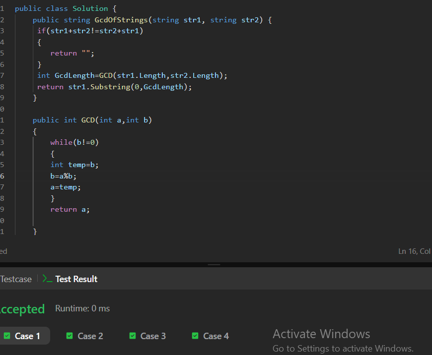

LeetCode Account :   https://leetcode.com/u/manar1116/

Problem name: Valid Anagram

Problem URL: https://leetcode.com/problems/valid-anagram/solutions/8533375/valid-anagram-by-manar1116-9gpi/

 How the solution determines whether the two strings are anagrams?
 
 at first the two strings must have the same length,if not make early exist 
 we made an array that has the same length of the alphabets
 -then we count how many every char appears in in the first string 
 then we subtract the count from the second string 
 if it is zero then it is anagram

  What happens when the strings have different lengths?
  then return from the method they can not be anagram

   How character frequencies can be compared?
   using a fixed size integer array that represents the alphabet. 
   Each index in the array corresponds to a specific lowercase letter

The time complexity of the solution? O(n)

 The space complexity of the solution?  O(1)

                                          Greatest Common Divisor of String

Problem Name:Greatest Common Divisor of Strings
Problem URL :https://leetcode.com/problems/greatest-common-divisor-of-strings/solutions/8533395/greatest-common-divisor-of-strings-by-ma-0git/

 What it means for one string to divide another string?

that we can use one of them reapted times to make the second one

• How repeated string patterns are detected
s + t == t + s
If both concatenations produce the same result, it means both strings share the same repeating pattern.

• Why some pairs of strings have no common divisor string
They do not share the same repeating pattern

Their concatenations differ (s + t != t + s)

• How the greatest valid pattern can be found
we devide the two length many times untile the reminder is zero and the take the result ro make substring

• The time complexity of the solution   O(n)

• The space complexity of the solution  O(1)

